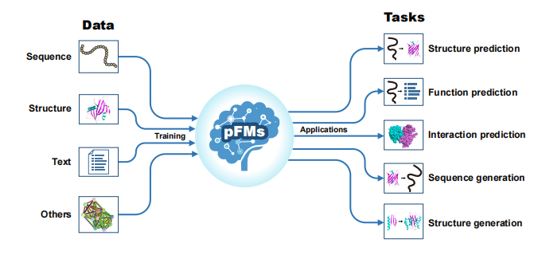

# Protein Foundation Models: A Comprehensive Survey

This repository contains the figures and tables used in the paper "Protein Foundation Models: A Comprehensive Survey". 

## Folder Structure
- `figures/`: Contains figures from the paper.
- `tables/`: Contains tables from the paper.

## Tables

### Table Data: Protein Databases

The table below provides details on various protein databases.

| DataBase     | Size                        | Last update | url                                                      |
| ------------ | --------------------------- | ----------- | -------------------------------------------------------- |
| UniProtKB    | 253M seq                    | 2025        | https://www.uniprot.org/                                 |
| UniRef       | 728M seq                    | 2025        | https://www.uniprot.org/                                 |
| UniParc      | 916M seq                    | 2025        | https://www.uniprot.org/                                 |
| Pfam         | 24K entries                 | 2025        | http://pfam.xfam.org/                                    |
| BFD          | 2.2B seq                    | 2021        | https://bfd.mmseqs.com/                                  |
| OAS          | >1B seq                     | 2021        | https://opig.stats.ox.ac.uk/webapps/oas                  |
| NCBI Virus   | 61M seq                     | 2025        | https://www.ncbi.nlm.nih.gov/labs/virus/vssi/#/          |
| PDB          | 251K struct                 | 2025        | https://www.wwpdb.org/                                   |
| AlphaFold DB | 214M struct                 | 2025        | https://alphafold.ebi.ac.uk/                             |
| CATH         | 601K domains                | 2024        | https://www.cathdb.info/                                 |
| PDA          | 1.5K struct                 | 2025        | https://pragmaticproteindesign.bio.ed.ac.uk/pda/         |
| SCOP         | 106K struct                 | 2023        | https://scop.berkeley.edu/                               |
| BFVD         | 351K struct                 | 2024        | https://bfvd.steineggerlab.workers.dev/                  |
| ESM Atlas    | 772M struct                 | 2023        | https://esmatlas.com/                                    |
| GO           | 8.6M annotations            | 2025        | https://geneontology.org/                                |
| PAN-GO       | 68K annotations             | 2025        | https://functionome.geneontology.org/                    |
| EC           | 8K classes                  | 2024        | https://www.enzyme-database.org/                         |
| KEGG         | 578 pathways                | 2025        | https://www.genome.jp/kegg/                              |
| InterPro     | 48k entries                 | 2025        | https://www.ebi.ac.uk/interpro/                          |
| PANTHER      | 2.6M genes                  | 2024        | https://pantherdb.org/                                   |
| BioCyc       | 20K pathways                | 2024        | https://biocyc.org/                                      |
| ProteinKG25  | 4,9M triplets/612K entities | 2023        | https://github.com/RL4M/KeAP/tree/main                   |
| ProThermDB   | 32K experiments             | 2023        | https://web.iitm.ac.in/bioinfo2/prothermdb/              |
| DeepLoc 2.1  | 4.9K proteins               | 2024        | https://services.healthtech.dtu.dk/services/DeepLoc-2.1/ |
| BioGRID      | 1M PTM                      | 2025        | https://thebiogrid.org/                                  |
| TargetTrack  | 350K proteins               | 2017        | https://zenodo.org/records/821654                        |
| HIPPIE       | 39K interactions            | 2022        | https://cbdm-01.zdv.uni-mainz.de/~mschaefer/hippie/      |
| STRING       | >20B PPI                    | 2022        | https://string-db.org/                                   |
| DIP          | 82K PPI                     | 2020        | https://dip.doe-mbi.ucla.edu/dip/Main.cgi                |
| IntAct       | 1.6M PPI                    | 2023        | https://www.ebi.ac.uk/intact/home                        |
| D-SCRIPT     | 305K PPI                    | 2021        | https://github.com/samsledje/D-SCRIPT                    |
| Predictomes  | 40K PPI                     | 2025        | https://predictomes.org/                                 |
| DTM, DDG     | 102 assays                  | 2024        | https://github.com/tyang816/ProtSSN                      |
| PROSITE      | 103K entries                | 2025        | https://prosite.expasy.org/                              |
| BindingDB    | 3M pairs                    | 2024        | https://www.bindingdb.org/rwd/bind/index.jsp             |
| ChEMBL       | 1.7M assays/2.5M Compounds  | 2024        | https://www.ebi.ac.uk/chembl/                            |
| KLIFS        | 4.1K ligands                | 2023        | https://klifs.net/                                       |
| Reactome     | 22k pathways                | 2025        | https://reactome.org/                                    |
| PDBbind      | 27K sets                    | 2025        | https://www.pdbbind-plus.org.cn/                         |
| SKEMPI 2.0   | 7K mutations                | 2018        | https://life.bsc.es/pid/skempi2                          |
| ProteinGym   | ~300k mutants               | 2022        | https://proteingym.org/                                  |
| TAPE         | 5 tasks                     | 2021        | https://github.com/songlab-cal/tape                      |
| PEER         | 14 tasks                    | 2022        | https://torchprotein.ai/benchmark                        |
| PETA         | 15 tasks                    | 2023        | https://github.com/ginnm/proteinpretraining              |
| ProteinGLUE  | 7 tasks                     | 2022        | https://github.com/ibivu/protein-glue                    |

### Table Model: Protein Foundation Models

The table below presents key information about various protein foundation models.

| Method (model name)     | Architecture    | Open source | Year | DOI                                                          |
| ----------------------- | --------------- | ----------- | ---- | ------------------------------------------------------------ |
| ESM-1b                  | Encoder         | √           | 2021 | [10.1073/pnas.2016239118](https://doi.org/10.1073/pnas.2016239118) |
| ProtTrans               | Encoder         | √           | 2021 | 10.48550/arXiv.2007.06225                                    |
| ESM-MSA-1b              | Encoder         | √           | 2021 | 10.1101/2021.02.12.430858                                    |
| ESM-1v                  | Encoder         | √           | 2021 | 10.1101/2021.07.09.450648                                    |
| PMLM                    | Encoder         | ×           | 2021 | 10.48550/arXiv.2110.15527                                    |
| AntiBERTy               | Encoder         | √           | 2021 | 10.48550/arXiv.2112.07782                                    |
| AlphaFold2              | Encoder         | √           | 2021 | 10.1038/s41586-021-03819-2                                   |
| AlphaFold-Multimer      | Encoder         | √           | 2021 | 10.1101/2021.10.04.463034                                    |
| bindEmbed21             | Encoder         | √           | 2021 | 10.1038/s41598-021-03431-4                                   |
| ProteinBert             | Encoder         | √           | 2022 | [10.1093/bioinformatics/btac020](https://doi.org/10.1093/bioinformatics/btac020) |
| DistilProtBert          | Encoder         | √           | 2022 | 10.1093/bioinformatics/btac474                               |
| LM‐GVP                  | Encoder         | √           | 2022 | 10.1038/s41598-022-10775-y                                   |
| OntoProtein             | Encoder         | √           | 2022 | 10.48550/arXiv.2201.11147                                    |
| SignalP 6.0             | Encoder         | √           | 2022 | 10.1038/s41587-021-01156-3                                   |
| AntiBERTa               | Encoder         | √           | 2022 | 10.1016/j.patter.2022.100513                                 |
| AbLang                  | Encoder         | √           | 2022 | 10.1101/2022.01.20.477061                                    |
| BepiPred-3.0            | Encoder         | √           | 2022 | 10.1002/pro.4497                                             |
| EMBER2                  | Encoder         | √           | 2022 | 10.1016/j.str.2022.05.001                                    |
| Evo-velocity            | Encoder         | √           | 2022 | 10.1016/j.cels.2022.01.003                                   |
| ESM-2                   | Encoder         | √           | 2023 | [10.1126/science.ade2574](https://doi.org/10.1126/science.ade2574) |
| ProteinNPT              | Encoder         | √           | 2023 | 10.1101/2023.12.06.570473                                    |
| RSA                     | Encoder         | √           | 2023 | 10.1101/2023.02.22.529597                                    |
| ESM-GearNet             | Encoder         | √           | 2023 | 10.48550/arXiv.2303.06275                                    |
| ProtFlash               | Encoder         | √           | 2023 | 10.1016/j.xcrp.2023.101600                                   |
| PromptProtein           | Encoder         | √           | 2023 | https://openreview.net/forum?id=XGagtiJ8XC                   |
| ProtST                  | Encoder         | √           | 2023 | 10.48550/arXiv.2301.12040                                    |
| AlphaMissense           | Encoder         | ×           | 2023 | 10.1126/science.adg7492                                      |
| CLEAN                   | Encoder         | √           | 2023 | 10.1126/science.adf2465                                      |
| IgFold                  | Encoder         | √           | 2023 | 10.1038/s41467-023-38063-x                                   |
| DTIOG                   | Encoder         | ×           | 2023 | 10.1186/s12859‐023‐05593‐6                                   |
| DTIAM                   | Encoder         | √           | 2023 | 10.48550/arXiv.2312.15252                                    |
| SaProt                  | Encoder         | √           | 2024 | 10.1101/2023.10.01.560349                                    |
| ESM3                    | Encoder         | √           | 2024 | 10.1126/science.ads0018                                      |
| ESM C                   | Encoder         | √           | 2024 | https://evolutionaryscale.ai/blog/esm-cambrian.              |
| CaLM                    | Encoder         | √           | 2024 | 10.1038/s42256-024-00791-0                                   |
| ESM All-Atom            | Encoder         | √           | 2024 | 10.1101/2024.03.04.583284                                    |
| AntiBERTa2              | Encoder         | √           | 2024 | 10.1101/2023.12.12.569610                                    |
| ProMEP                  | Encoder         | √           | 2024 | 10.1038/s41422-024-00989-2                                   |
| ProSST                  | Encoder         | √           | 2024 | 10.1101/2024.04.15.589672                                    |
| RoseTTAFold2-Lite       | Encoder         | √           | 2024 | 10.1038/s41564-024-01791-x                                   |
| RoseTTAFold2-PPI        | Encoder         | √           | 2024 | 10.1101/2024.10.01.615885                                    |
| CARBonAra               | Encoder         | √           | 2024 | 10.1038/s41467-024-50571-y                                   |
| HLApollo                | Encoder         | ×           | 2024 | 10.1038/s41467-024-54887-7                                   |
| tcrLM                   | Encoder         | √           | 2024 | 10.1109/BIBM62325.2024.10822735                              |
| DeepNeoAG               | Encoder         | √           | 2024 | 10.1016/j.ijbiomac.2024.136252                               |
| ProtGPS                 | Encoder         | √           | 2025 | 10.1126/science.adq2634                                      |
| PLMeAE                  | Encoder         | ×           | 2025 | 10.1038/s41467-025-56751-8                                   |
| Mal-ID                  | Encoder         | √           | 2025 | 10.1126/science.adp2407                                      |
| PTM-Mamba               | Encoder         | √           | 2025 | 10.1038/s41592-025-02656-9                                   |
| AlphaFold-Metainference | Encoder         | √           | 2025 | 10.1038/s41467-025-56572-9                                   |
| MINT                    | Encoder         | √           | 2025 | 10.1101/2025.03.09.642188                                    |
| Seq2Symm                | Encoder         | √           | 2025 | 10.1038/s41467-025-57148-3                                   |
| Proteina                | Encoder         | √           | 2025 | 10.48550/arXiv.2503.00710                                    |
| ProGen                  | Decoder         | √           | 2020 | 10.48550/arXiv.2004.03497                                    |
| ProtGPT2                | Decoder         | √           | 2022 | 10.1101/2022.03.09.483666                                    |
| ZymCTRL                 | Decoder         | √           | 2022 | 10.1101/2024.05.03.592223                                    |
| RITA                    | Decoder         | √           | 2022 | 10.48550/arXiv.2205.05789                                    |
| IgLM                    | Decoder         | √           | 2022 | 10.1101/2021.12.13.472419                                    |
| ProGen2                 | Decoder         | √           | 2023 | 10.1016/j.cels.2023.10.002                                   |
| PoET                    | Decoder         | ×           | 2023 | NeurIPS 2023                                                 |
| Fold2Seq                | Encoder-Decoder | √           | 2021 | 10.48550/arXiv.2106.13058                                    |
| RoseTTAFold             | Encoder-Decoder | √           | 2021 | 10.1126/science.abj8754                                      |
| MSA2Prot                | Encoder-Decoder | ×           | 2022 | 10.48550/arXiv.2204.01168                                    |
| ESM-IF1                 | Encoder-Decoder | √           | 2022 | 10.1101/2022.04.10.487779                                    |
| OmegaFold               | Encoder-Decoder | √           | 2022 | 10.1101/2022.07.21.500999                                    |
| AminoBERT               | Encoder-Decoder | √           | 2022 | 10.1038/s41587-022-01432-w                                   |
| DeepLoc 2.0             | Encoder-Decoder | ×           | 2022 | 10.1093/nar/gkac278                                          |
| trRosettaX-Single       | Encoder-Decoder | √           | 2022 | 10.1038/s43588-022-00373-3                                   |
| KeAP                    | Encoder-Decoder | √           | 2023 | 10.48550/arXiv.2301.13154                                    |
| LM-Design               | Encoder-Decoder | √           | 2023 | https://proceedings.mlr.press/v202/zheng23a.html             |
| MSA-Augmenter           | Encoder-Decoder | √           | 2023 | 10.48550/arXiv.2306.01824                                    |
| SS-pLM                  | Encoder-Decoder | ×           | 2023 | 10.1101/2023.08.04.551626                                    |
| pAbT5                   | Encoder-Decoder | ×           | 2023 | 10.48550/arXiv.2301.02748                                    |
| Ankh                    | Encoder-Decoder | √           | 2023 | 10.48550/arXiv.2301.06568                                    |
| RoseTTAFold2            | Encoder-Decoder | √           | 2023 | 10.1101/2023.05.24.542179                                    |
| ProstT5                 | Encoder-Decoder | √           | 2024 | [10.1093/nargab/lqae150](https://pmc.ncbi.nlm.nih.gov/articles/PMC11616678/) |
| ESM-GearNet-INR-MC      | Encoder-Decoder | ×           | 2024 | https://openreview.net/forum?id=BEH4mGo7zP                   |
| ProtLLM                 | Encoder-Decoder | √           | 2024 | 10.48550/arXiv.2403.07920                                    |
| RoseTTAFold All-Atom    | Encoder-Decoder | √           | 2024 | 10.1126/science.adl2528                                      |
| EVOLVEpro               | Encoder-Decoder | √           | 2024 | 10.1126/science.adr6006                                      |
| OpenFold                | Encoder-Decoder | √           | 2024 | 10.1038/s41592-024-02272-z                                   |
| ProteinGPT              | Encoder-Decoder | √           | 2024 | arXiv:2408.11363                                             |
| xTrimoPGLM              | Encoder-Decoder | √           | 2025 | 10.48550/arXiv.2401.06199                                    |
| ProtET                  | Encoder-Decoder | √           | 2024 | 10.34133/hds.0211                                            |
| DiffAb                  | Diffusion       | √           | 2022 | https://openreview.net/forum?id=jSorGn2Tjg                   |
| RFdiffusion             | Diffusion       | √           | 2023 | 10.1038/s41586-023-06415-8                                   |
| Chroma                  | Diffusion       | √           | 2023 | 10.1038/s41586-023-06728-8                                   |
| ProteinSGM              | Diffusion       | √           | 2023 | 10.1101/2022.07.13.499967                                    |
| FrameDiff               | Diffusion       | √           | 2023 | 10.48550/arXiv.2302.02277                                    |
| EigenFold               | Diffusion       | √           | 2023 | 10.48550/arXiv.2304.02198                                    |
| DiffDock                | Diffusion       | √           | 2023 | 10.48550/arXiv.2210.01776                                    |
| Genie                   | Diffusion       | √           | 2023 | 10.48550/arXiv.2301.12485                                    |
| DPLM                    | Diffusion       | √           | 2024 | 10.48550/arXiv.2402.18567                                    |
| DPLM-2                  | Diffusion       | √           | 2024 | 10.48550/arXiv.2410.13782                                    |
| AlphaFold3              | Diffusion       | √           | 2024 | 10.1038/s41586-024-07487-w                                   |
| FoldingDiff             | Diffusion       | √           | 2024 | 10.1038/s41467-024-45051-2                                   |
| DiffSBDD                | Diffusion       | √           | 2024 | 10.1038/s43588-024-00737-x                                   |
| ProtDiff                | Diffusion       | √           | 2024 | https://openreview.net/forum?id=ufoCkSqD79                   |
| Genie 2                 | Diffusion       | √           | 2024 | 10.48550/arXiv.2405.15489                                    |
| AlphaFolding            | Diffusion       | √           | 2024 | 10.48550/arXiv.2408.12419                                    |
| RFdiffusion All-Atom    | Diffusion       | √           | 2024 | 10.1126/science.adl2528                                      |
| BioEmu                  | Diffusion       | √           | 2025 | 10.1101/2024.12.05.626885                                    |
| PLACER                  | Diffusion       | √           | 2025 | 10.1126/science.adu2454                                      |
| InstaNovo+              | Diffusion       | √           | 2025 | 10.1038/s42256-025-01019-5                                   |
| RFdiffusion2            | Diffusion       | √           | 2025 | 10.1101/2025.04.09.648075v2                                  |
| Chai-1                  | Diffusion       | √           | 2024 | 10.1101/2024.10.10.615955                                    |
| Boltz-1                 | Diffusion       | √           | 2024 | 10.1101/2024.11.19.624167                                    |
| Protenix                | Diffusion       | √           | 2025 | 10.1101/2025.01.08.631967                                    |

## Contributions
### Contact
For inquiries, feedback, or suggestions, please reach out to **Hao Xu** at xuhao@bmi.ac.cn. Your input is highly appreciated!